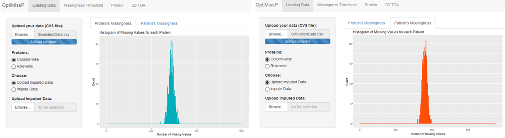

# OptiMissP Dashboard

The dashboard allows a qualitative and visual assessment of the missingness of data-independent acquisition mass spectrometry proteomic data. It contributes to define a better informed combination of imputation method and missingess threshold for the handling of missing values. 

The first panel allows the upload of the original not imputed proteomic dataset and its imputation. Otherwise, the user can upload the imputed dataset too. 

All the four panels are devoted to different types of data exploration:
* **Missingness' distribution**: two histrograms show the distribution of the number of missing values for instances (patients) and features (proteins)
* **Protein intensity distribution**: protein intensity distributions of imputed and not imputed data for different user selected missingness thresholds are put in comparison
* **Single protein intensity distribution**: chosen a specific protein, its protein distributions of imputed and not imputed data are comparatively plotted 
* **Topological Data Analysis of proteomic data**: Topological Data Analysis enables the creation of topologies from imputed and not imputed data for different missingness thresholds

# User guide

OptiMissP is a dashboard based on two components dedicated to upload the original not-imputed datasets and to perform an imputation step, in order to retrieve an imputed dataset to compare with the original one. The user can choose between Lowest Value Imputation under the assumption of missingness not at random (meaning: protein intensities are missing because too low and so under the instrumentation detection limit) and MissForests, MICE, Probabilistic PCA and E-M imputation under the assumption of missingness at random.

Three components (2,4,5) are used to analyse missingness distribution and compare the informative value of the imputed and non-imputed datasets and a final component (6) to perform TDA. These are integrated with two components (1,3) to upload and impute data. Each of the components is described in detail as follows:

1)	The Uploader serves to upload text files of non-imputed (or pre-imputed) data. The text files should ideally have instances (patients) organized into rows and features (proteins) arranged into columns, but the user can select if the proteins are presented column-wise or row-wise in the uploaded dataset.

2)	Explorative histograms are aimed at assessing the global missingness in the dataset. They show the frequency of missing values from both a patient (i.e. number of missing protein values in each sample) and protein (i.e. number of samples with a missing value for each protein) perspective.

That's the result of uploading the not imputed dataset. Histrograms describing how missingness is distributed across proteins and patients appear immediately in the tabs on the right.

Our dataset has proteins' intensities in the dataset's columns, and the "Protein button" is correctly setted as "column-wise". If we switch it to "row-wise", we can see in the figure below that the histrograms swap positions as the dataset is translated. This decision affects the following analysis too.

[Figure with row-wise]

3)	The imputation component implements the optional imputation of the data in real-time by allowing for method selection between MICE, MissForest, Probabilistic PCA, E-M imputation and Lowest Value; alternatively, the user may choose to upload a dataset already imputed.

As in the figure, just choose an imputation method and click the "Impute!" button. Otherwise upload an imputed dataset just like you did with the not imputed one at step 1).

[Figure of impute methods with loading...]

4)	The fourth component presents the distribution of the mean protein intensity in the imputed versus non-imputed datasets and allows for the head-to-head visual comparison of the protein’s intensities in imputed and non-imputed data in the whole studied cohort. A slider widget allows for the selection of a missingness threshold: for the complete dataset, it filters out those with fewer missing values than the selected threshold (i.e. if the threshold is set to 80% only proteins with less than the 80% missing values in the samples are considered). As the missingness threshold is selected with the slider, density plots illustrate the two distributions (in imputed and non-imputed data) and their overlap.      Distributions’ peaks (computed as maximum of value of the density function) are highlighted with a vertical dashed line. The graphic outputs are complemented with quantitative details about the number of considered proteins, the percentage of missing values in both imputed and not imputed datasets, and statistical parameters for a quantitative comparison between the distribution of imputed and not imputed data. These indicators include information about distributions’ quartiles and peaks (and their distance), and the p-value of the two-sample Kolmogorov-Smirnov test used to compare the two distributions.

The picture below reports some screenshots of the distributions for different missingness thresholds.

5)	In this section, the user can choose a specific protein of interest by its code or name (as identified in the dataset) and observe its degree of missingness and the discrepancy between its intensities’ distributions in imputed and non-imputed data. This is particularly useful to observe how the distribution of a specific protein (e.g. a potential biomarker) is affected by the choice of the imputation method, as it may influence the validity of downstream analysis on that protein.

Here some examples of distriutions for different proteins.

[Figure with different proteins distr]

6)	The TDA Mapper component performs a two-dimensional topological analysis to show data-driven topologies built from imputed and non-imputed data. The user can decide on which TDA Mapper parameters and missingness threshold to use. Additional features enrich the resulting network with information about the missingness in each node (determined by the mean percentage) and any observed clusters in the topologies (and the options to optimize these). Identification of clusters within the TDA network is based on the cluster_optimal R function.

The user can choose TDA's resolution parameters and lenses, if he/she desideres to enrich the topologis with missingness information or perform an optimal clustering.

[foto not enriched, enriched, clustering]

The user can explore missingness thresholds with the comparative density plots of imputed and non-imputed data. This allows the user to select missingness thresholds with a slider widget and shows the overlapping distributions of imputed (in red) and non-imputed (in blue) protein intensities given the selected threshold, as density plots. Within this section, it is also possible to choose a specific protein by its name (from a drop-down menu) and observe the density plots of imputed and non-imputed data for the selected protein only. 
Finally, the last tab focuses on the application of TDA Mapper. Here the user can re-set the thresholds of missingness, choose TDA basic (resolution and geometric scale) and advanced (function for data projection into space) parameters and run the analysis. The dashboard will display two resulting networks: the top one based on non-imputed data (i.e. the information about missingness is not included to build the shape and represent the data) and the bottom one based on imputed data. It is also possible to enrich the networks with the average missingness of each of the subjects in the TDA nodes, retrieved from the non-imputed dataset.

